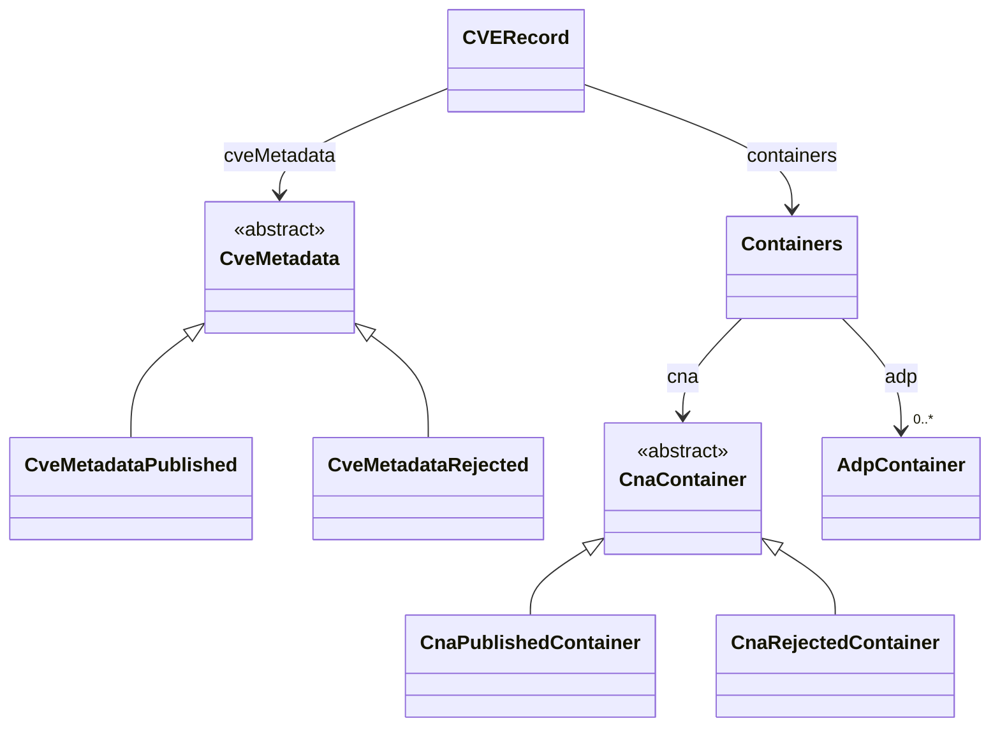

# About cve

A [LinkML](https://linkml.io/) schema for the [CVE Record Format v5.2.0](https://github.com/CVEProject/cve-schema), the
canonical exchange format for entries in the [CVE™ Program](https://www.cve.org/).

## Goals

- **Faithfully model** every required and optional field of the upstream JSON Schema so that every official CVE Record validates without loss.
- **Provide a single source of truth** from which idiomatic artifacts are generated for downstream consumers (Python dataclasses + Pydantic, JSON Schema, JSON-LD context, GraphQL, Protobuf, SHACL/ShEx, SQL DDL, OWL/TTL, TypeScript, Java, Excel).
- **Bridge** the CVE record format with adjacent vulnerability schemas (KEV Catalog, CWE, NIST NVD) through a small shared core, mappings, and semantic vocabularies (Wikidata, schema.org, Dublin Core, SKOS).
- **Stay close to the spec**: identifier patterns (`CVE-YYYY-N{4,19}`), enum permissible values, and cardinality match upstream verbatim; field names use snake_case slots with camelCase `aliases:` for JSON interop.

## Source layout

| Path | Purpose |
| ---- | ------- |
| [src/cve/schema/cve.yaml](../src/cve/schema/cve.yaml) | Main schema modelling the CVE Record Format v5.2.0 |
| [src/cve/schema/vulnerability_core.yaml](../src/cve/schema/vulnerability_core.yaml) | Shared base (types, enums, slots, abstract classes) reused by KEV / CVE / CWE / NVD |
| [src/cve/datamodel/](../src/cve/datamodel/) | Generated Python dataclasses (`cve.py`) and Pydantic models (`cve_pydantic.py`) |
| [project/](../project/) | Generated per-language artifacts (JSON Schema, GraphQL, Java, etc.) |
| [src/cve/mappings/](../src/cve/mappings/) | SSSOM mappings to CWE, KEV Catalog, NIST NVD |
| [tests/data/third_party/cveschema/](../tests/data/third_party/cveschema/) | Upstream CVE Project example records, validated as part of CI |

## High-level structure

A CVE Record (`CVERecord`) is a wrapper document with four top-level fields:

| Field | Type | Notes |
| ----- | ---- | ----- |
| `dataType` | constant `CVE_RECORD` | Record kind discriminator |
| `dataVersion` | constant `5.2.0` | Format version |
| `cveMetadata` | `CveMetadata` (abstract) | Published or Rejected metadata |
| `containers` | `Containers` | One CNA container + optional ADP containers |

The CNA and metadata branches are modelled as **abstract bases with concrete subclasses**, exposed to consumers via slot-level `any_of`:



State is the discriminator: `cveMetadata.state == PUBLISHED` selects the `*Published` shapes; `REJECTED` selects the `*Rejected` shapes.

## Design decisions

### 1. Snake-case slots with camelCase aliases

Upstream JSON uses camelCase (`cveMetadata`, `dataPublished`, `cpeApplicability`, …). The schema declares snake_case slot names (LinkML convention) and adds the upstream key as a `aliases:` entry. Generated JSON Schema accepts the camelCase form; the [`tests/test_third_party.py`](../tests/test_third_party.py) translator uses the alias map to consume vendor JSON without manual rewriting.

### 2. Polymorphism via subclasses, not `union_of`

`CveMetadata` and `CnaContainer` are abstract with two concrete subclasses each. The discriminator (`state`) lives on the subclasses; consumers pick the right shape with slot-level `any_of`:

```yaml
cve_metadata:
  range: CveMetadata
  any_of:
    - range: CveMetadataPublished
    - range: CveMetadataRejected
```

This is the workaround for an issue (`gen-json-schema` emits `{}` instead of `oneOf` for class-level `union_of`). The slot-level
`any_of` produces a clean `anyOf` in the generated JSON Schema while still letting `gen-python` / `gen-pydantic` materialise both concrete classes.

### 3. `CVERecord` is *not* an `is_a Vulnerability`

[`vulnerability_core.Vulnerability`](../src/cve/schema/vulnerability_core.yaml) declares `cve_id` as `identifier: true, required: true` — correct for the vulnerability *entity*, wrong for the *document* that wraps one. The CVE Record places its ID at `cveMetadata.cveId`, not at the root.

Per the LinkML metamodel, [identifiers cannot be optional](https://linkml.io/linkml-model/latest/docs/identifier/), so `slot_usage: { cve_id: { required: false } }` is intentionally a no-op. The schema therefore expresses semantic equivalence via `exact_mappings` instead of `is_a`:

```yaml
CVERecord:
  tree_root: true
  exact_mappings:
    - WIKIDATA:Q631425
    - core:Vulnerability
```

The same reasoning applies to `AffectedProduct` vs `core:Product`.

### 4. CVSS metrics: one class per major version

`CvssV4_0`, `CvssV3` (covers 3.0 and 3.1 via a `cvss3_version` discriminator), and `CvssV2_0` are first-class types. A `MetricEntry` references one of them through optional slots plus a top-level `format` discriminator that matches upstream behaviour. Non-standard scoring (e.g. SSVC) is captured via `OtherMetric.content` typed as `Any`, faithful to the upstream "free-form proprietary payload" semantics.

### 5. Conditional cardinality

Several upstream invariants are expressed with LinkML's boolean slot conditions, e.g. on `AffectedProduct`:

```yaml
all_of:
  - any_of:
      - slot_conditions: { vendor: { required: true }, name: { required: true } }
      - slot_conditions: { collection_url: { required: true }, package_name: { required: true } }
  - any_of:
      - slot_conditions: { versions:        { required: true } }
      - slot_conditions: { default_status:  { required: true } }
```

These translate to JSON-Schema `allOf`/`anyOf` blocks that reproduce the upstream "at least one of vendor+product *or* collectionURL+packageName" rules without scripting.

### 6. String-length bounds via `annotations`

LinkML's core metamodel lacks first-class `min_length` / `max_length`. For interop fidelity, string slots that have explicit upstream bounds carry annotations:

```yaml
description_value:
  range: string
  annotations:
    min_length: 1
    max_length: 4096
```

`gen-owl` surfaces these as XSD facets; other generators ignore them today but the data is captured for future generator support.

### 7. Mapping vocabularies

Each concept is annotated with mappings to:

- Wikidata (`WIKIDATA:Q631425` for Vulnerability)
- schema.org (`schema:SoftwareApplication` for affected products)
- Dublin Core Terms (`dcterms:title`, `dcterms:description`, etc.)
- SKOS, RDFS for taxonomic relationships
- Sibling schemas: `nvd:NVDEntry`, `cwe:Weakness`, `kev_catalog:KevEntry`

SSSOM tables in [src/cve/mappings/](../src/cve/mappings/) provide row-level mappings to CWE, KEV, and NVD entries.

## Validation strategy

Three independent checks gate every change:

1. **`just lint`** — `linkml-lint` against the configured ruleset ([.linkmllint.yaml](../.linkmllint.yaml)).
2. **`just gen-project`** — all generators must succeed and produce the artefacts under [project/](../project/).
3. **`just test`** — `pytest` runs three suites:
   - `tests/test_data.py` validates curated valid / invalid fixtures.
   - `tests/test_third_party.py` validates the 13 official upstream example records under [tests/data/third_party/cveschema/](../tests/data/third_party/cveschema/).
   - Pydantic roundtrip checks ensure no upstream field is silently dropped.

## References

- [CVE Program — cve.org](https://www.cve.org/)
- [CVE Record Format v5.2.0 schema](https://github.com/CVEProject/cve-schema/tree/main/schema/docs)
- [LinkML](https://linkml.io/)
- [SSSOM](https://mapping-commons.github.io/sssom/) — mapping format used in
  [src/cve/mappings/](../src/cve/mappings/)